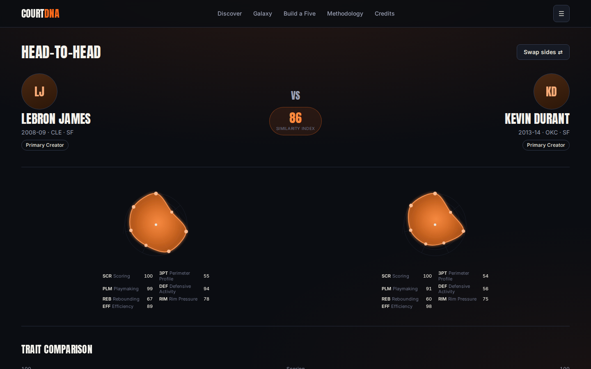
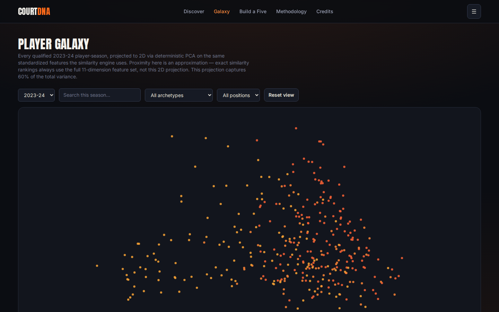
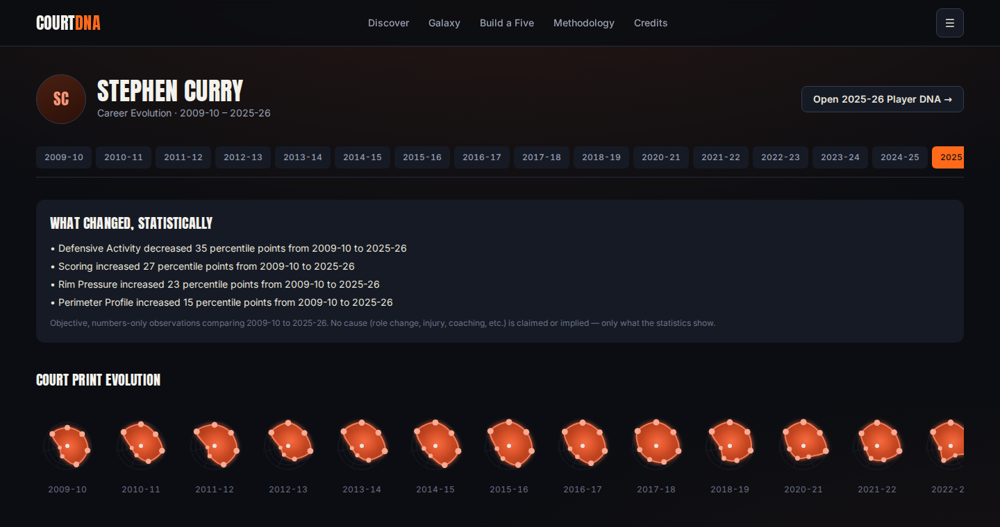
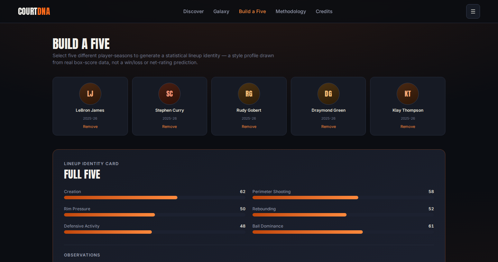
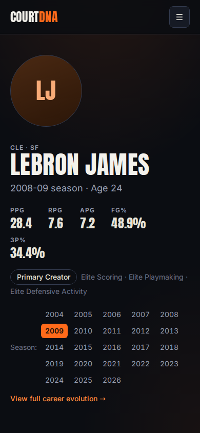

# COURT DNA — Basketball Player Style Explorer


> Independent basketball analytics project. Not affiliated with or endorsed
> by the NBA or any NBA team.

## What COURT DNA is

**Explore how basketball players score, create, defend, and evolve.**

COURT DNA builds a transparent statistical fingerprint for every qualifying
NBA player-season from 2000-01 through 2025-26, then answers three
questions with real math, not a black box: what makes a player's game
statistically unique, who actually resembles them, and where that
comparison comes from. A documented, weighted-distance formula — not an
opaque ML model — finds the matches, and a deterministic template layer
explains exactly which stats drive each one.

## Live experience

Eight real, working screens, not a static dashboard:

| Screen | What it does |
|---|---|
| **Home / Discover** | Global search, featured player-seasons, entry points |
| **Player DNA** | Court Print, percentile traits, Shot DNA, closest statistical matches with live filters |
| **Head-to-Head** | Split-screen matchup: Court Prints, trait bars, Shot DNA, deterministic match/separate explanations |
| **Player Galaxy** | Every qualified season for a year, plotted via deterministic PCA, zoom/pan/search/filter, nearest-neighbor highlighting |
| **Career Evolution** | Season-by-season timeline, Court Print evolution, objective statistical callouts |
| **Build a Five** | Assemble 5 player-seasons into a lineup identity card with deterministic observations |
| **Methodology** | The full analytical writeup, in plain language |
| **Photo Credits** | Searchable attribution for every real player photo used |

## Screenshots

<table>
<tr>
<td width="50%"><br/><sub>Head-to-Head</sub></td>
<td width="50%"><br/><sub>Player Galaxy</sub></td>
</tr>
<tr>
<td width="50%"><br/><sub>Career Evolution</sub></td>
<td width="50%"><br/><sub>Build a Five</sub></td>
</tr>
</table>



## How the player fingerprint works

Every qualifying player-season becomes a 12-feature vector — scoring load,
efficiency, shot profile, playmaking/turnover style, rebounding, defensive
activity — winsorized and standardized **within its own season**, since
league environments in 2001 and 2026 were not the same (three-point rate
alone roughly tripled). A weighted RMS distance between two standardized
vectors converts to a 0–100 **Similarity Index**:

```
Similarity Index = max(0, 100 − 20 × weighted_RMS_distance)
```

A score of 91 means 91/100 on this project's statistical similarity index —
**not** a 91% probability two players are alike. Awards, popularity, Hall of
Fame status, draft position, names, and team reputation never factor into
the calculation. Full writeup: [`docs/methodology.md`](docs/methodology.md).

## Data

12,810 canonical player-seasons (2000-01–2025-26), one profile per
`(player_id, season)` — traded players' `2TM`/`3TM` aggregate rows are used
for the statistical profile; individual-team rows are kept only for
team-history display, verified against a real example (James Harden's
2025-26 season) as an automated regression test. Full pipeline and current
real counts: [`docs/data.md`](docs/data.md).

| | |
|---|---|
| Unique players (detail page) | **1,900** |
| Canonical player-seasons | **12,810** |
| Qualified comparison/Galaxy player-seasons | **8,923** |

## Similarity methodology

| Group | Weight |
|---|---|
| Shot profile | 25% |
| Scoring load | 20% |
| Playmaking / turnover style | 20% |
| Defensive activity | 15% |
| Efficiency | 10% |
| Rebounding | 10% |

Implemented twice — Python (`analysis/similarity.py`) and TypeScript
(`lib/similarity.ts`) — with 32 real player-season pairs checked for exact
agreement between the two. Full detail: [`docs/methodology.md`](docs/methodology.md).

## Photo attribution

Player photos come only from Wikimedia Commons, resolved via a real
Wikidata → Commons pipeline (`scripts/resolve_photos.py`) that records exact
license/creator metadata and never guesses an identity. This sandboxed build
environment couldn't reach Wikimedia to run it at scale, so **5 players have
real, verified photos**; everyone else uses a polished fallback graphic that
never breaks layout. Full honest account:
[`docs/photo-attribution.md`](docs/photo-attribution.md).

## Tech stack

**Frontend:** Next.js · React · TypeScript · Tailwind CSS · D3 (Galaxy) ·
Framer Motion
**Analysis:** Python · Pandas · NumPy · scikit-learn (deterministic PCA)
**Photos:** Wikimedia Commons / Wikidata APIs

## Run locally

```bash
git clone https://github.com/harjotsandhu24/court-dna-basketball-analytics.git
cd court-dna-basketball-analytics
npm install
npm run dev
```

Then open the local URL (typically `http://localhost:3000`). The app reads
only the committed, precomputed files in `public/data/` — no Python or
internet access required to run it.

```bash
npm run build   # production build
npm test        # TypeScript test suite (47 tests)
npm run lint     # ESLint
```

**Windows note:** if PowerShell blocks `npm.ps1`, use `npm.cmd install` /
`npm.cmd run dev` instead of changing your system-wide execution policy.

## Rebuild the analytics

Requires `archive.zip` from Kaggle (CC0 — see [`docs/data.md`](docs/data.md)
for the exact dataset/link/checksum; not committed here for repository
cleanliness, not a licensing concern) and `pip install -r requirements.txt`:

```bash
python3 scripts/prepare_raw.py /path/to/archive.zip --verify-checksum
pip install -r requirements.txt

cd analysis
python3 step1_validate_source.py
python3 step2_build_canonical.py
python3 step3_features_traits.py
python3 step4_archetypes.py
python3 step5_galaxy_pca.py
python3 step6_export_frontend_data.py
```

To (re)resolve player photos, with real internet access:

```bash
python3 scripts/resolve_photos.py --all
```

## QA

**20/20** Python pipeline tests, **47/47** TypeScript tests (including 32
Python↔TypeScript similarity-parity checks), clean lint/typecheck/production
build, zero horizontal overflow across 32 width×route combinations
(1440/1024/768/390px), verified keyboard focus states and
`prefers-reduced-motion` handling. One real overflow bug and one real
archetype-mislabeling bug were found and fixed during development, each with
a regression test. Full results, including what could and couldn't be
tested in this environment: [`docs/qa.md`](docs/qa.md).

## Limitations

Box-score stats can't capture screening, spacing gravity, or off-ball value;
PCA is a 2D approximation (58.6% average variance explained), not the actual
similarity ranking; only 5 of 1,900 players have a real photo in this build;
only Chromium could be tested (Firefox/WebKit blocked by this sandbox's
network restrictions). Full list, stated plainly rather than buried:
[`docs/limitations.md`](docs/limitations.md).
