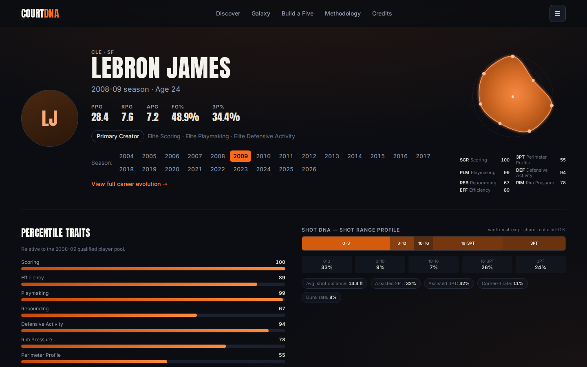

# COURT DNA — Basketball Player Style Explorer



> Independent basketball analytics project. Not affiliated with or endorsed
> by the NBA or any NBA team.

**Live app: [court-dna-basketball-analytics.vercel.app](https://court-dna-basketball-analytics.vercel.app/)**

COURT DNA is an interactive NBA player comparison tool built from more than
25 years of player data. Search players, compare playing styles, find
similar players, explore career changes, and build lineups.

## What it does

- Compare two NBA players side by side.
- Find players with similar playing styles.
- Explore how a player's game changed across their career.
- See shooting patterns and seven parts of a player's style.
- Explore players on an interactive map.
- Build a five-player lineup and see its combined style.

## How comparisons work

Every player-season is scored on how they score, shoot, pass, rebound, and
defend, using 12 statistical features. Two players' scores are compared to
produce a 0–100 Style Match — a similarity score, not a probability. Full
formula and methodology: [`docs/methodology.md`](docs/methodology.md).

## Data

2000-01 through 2025-26 · 12,810 canonical player-seasons · 1,900 players
with profile pages · 8,923 comparison-eligible player-seasons. Source:
Kaggle NBA Stats dataset (CC0). Full detail and reproduction steps:
[`docs/data.md`](docs/data.md).

## Tech

Next.js · React · TypeScript · D3 · Python · Pandas · NumPy · scikit-learn

## Run locally

```bash
git clone https://github.com/harjotsandhu24/court-dna-basketball-analytics.git
cd court-dna-basketball-analytics
npm install
npm run dev
```

```bash
npm test
npm run lint
npm run build
```

## QA

The repo has 20 Python tests and 79 TypeScript tests (6 files). Run
`npm test`, `npm run lint`, `npx tsc --noEmit` and `npm run build` to
verify; `docs/qa.md` lists what each test file covers. Responsive overflow QA passed across
48 width × route combinations. Full results: [`docs/qa.md`](docs/qa.md).

## Known limitations

- Box-score data cannot capture every part of basketball, especially
  off-ball impact and full defensive quality.
- The Player Map is a 2D view of a larger statistical model and is not
  used for the actual similarity ranking.
- Only five player photos are included in this build; other players use
  the fallback graphic.

Full list: [`docs/limitations.md`](docs/limitations.md).

## Documentation

- [Methodology](docs/methodology.md)
- [Data & reproduction](docs/data.md)
- [QA](docs/qa.md)
- [Limitations](docs/limitations.md)
- [Photo attribution](docs/photo-attribution.md)
